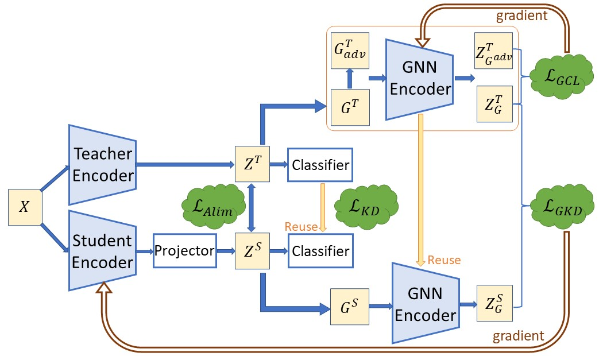

# GCKD

## Introduction
This repo contains the Pytorch implementation of Graph Contrastive Knowledge Distillation for Self-supervised Models (GCKD). 


### An overview of GCKD



### Experiments on Cifia-100


The implementation of compared methods are based on the author-provided code and a open-source benchmark https://github.com/HobbitLong/RepDistiller.

## Requirements and Environment Setup

Code developed and tested in Python 3.6.15 using PyTorch 1.10.0+cu113 and dgl 1.0.1+cu113.
As for ImageNet, we use [DALI](https://github.com/NVIDIA/DALI) for data loading and pre-processing.
Please refer to their official websites for installation and setup.

Other major requirements are given in file requirements.txt.

```
conda install --yes --file requirements.txt
```

## Running

1. Fetch the pretrained teacher models by:

    ```
    sh scripts/fetch_pretrained_teachers.sh
    ```
   which will download and save the models to `save/teachers/models`

2. Run distillation by commands in `scripts\run_distill.sh`. An example of running GCKD is given by:

    ```
    python train_student.py --path_t ./save/teachers/models/resnet32x4_vanilla/resnet32x4_best.pth --model_s resnet8x4 --distill gckd --last_feature 1 --gnnlayer TAG --layers 2 --gnnencoder one --adj_k 8 --NPerturb 0.1 --EPerturb 0 -c 1 -d 1 -m 1 -b 3 --trial 1
    ```

Here's a summary of each hyperparameter in train_student.py
```
1. Basic:
   - `print_freq`: Frequency of printing training progress.
   - `batch_size`: Number of samples in each mini-batch.
   - `num_workers`: Number of workers to use for data loading.
   - `epochs`: Number of training epochs.
   - `gpu_id`: ID(s) of the GPU(s) to be used.

2. Optimization:
   - `learning_rate`: Learning rate for the optimizer.
   - `lr_decay_epochs`: Epochs at which the learning rate should be decayed. It can be a list of values.
   - `lr_decay_rate`: Decay rate for the learning rate.
   - `weight_decay`: Weight decay (L2 regularization) for the optimizer.
   - `momentum`: Momentum value for the optimizer.
   - `cos`: Flag indicating whether to use a cosine learning rate schedule.

3. Dataset and Model:
   - `dataset`: Dataset to be used ('cifar100' or 'imagenet').
   - `model_s`: Student model architecture.
   - `path_t`: Path to the teacher model.

4. Distillation:
   - `trial`: Trial ID.
   - `kd_T`: Temperature for Knowledge Distillation (KD).
   - `cl_T`: Temperature for Contrastive Learning (CL) distillation.
   - `distill`: Distillation method to be used.
   - `cls`: Weight for the classification loss.
   - `div`: Weight balance for KD.
   - `mu`: Weight balance for feature L2 loss.
   - `beta`: Weight balance for other losses.
   - `gama`: Weight balance for other losses.
   - `factor`: Size factor for SimKD.
   - `soft`: Attention scale for SemCKD.

5. Hint Layer:
   - `hint_layer`: Index of the hint layer.

6. NCE Distillation:
   - `feat_dim`: Feature dimension.
   - `mode`: Mode for NCE distillation ('exact' or 'relax').
   - `nce_k`: Number of negative samples for Noise Contrastive Estimation (NCE).
   - `nce_t`: Temperature parameter for softmax.
   - `nce_m`: Momentum for non-parametric updates.

7. GCL (Graph Contrastive Learning):
   - `gadv`: Learnable graph augmentation method ('adgcl' or 'None').
   - `NPerturb`: Node perturbation rate of graph augmentation.
   - `EPerturb`: Edge perturbation rate of graph augmentation.
   - `gnnlayer`: Type of Graph Neural Network (GNN) layer.
   - `layers`: Depth of GNN layers.
   - `last_feature`: The embedding from the last nth layers of the model.
   - `gnnencoder`: GNN encoder update method.
   - `loss_func`: Form of contrastive loss.
   - `adj_k`: k of adjacency matrix.

8. Multiprocessing:
   - `dali`: DALI library usage ('cpu' or 'gpu').
   - `multiprocessing-distributed`: Flag for multi-processing distributed training.
   - `dist-url`: URL used to set up distributed training.
   - `deterministic`: Flag for making results reproducible.
   - `skip-validation`: Flag for skipping teacher validation.

```